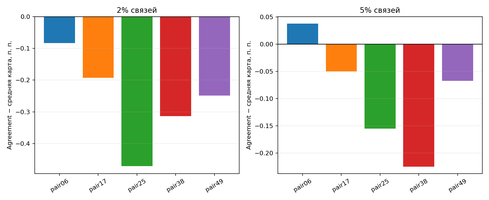
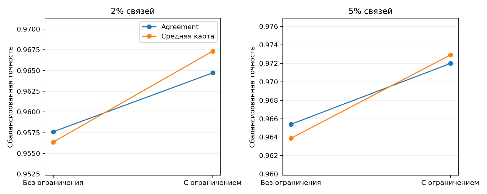
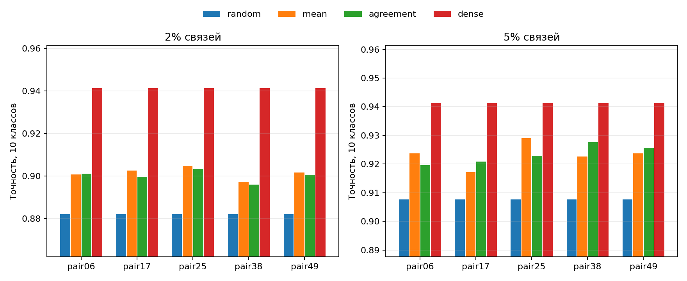
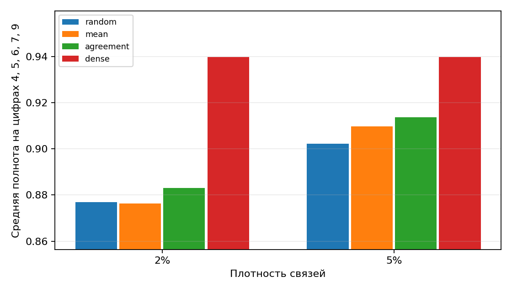

# Ночной запуск MNIST8m

Сбалансированная точность после нового обучения MLP; маски одинаковой плотности, 4 инициализации на маску.

| Пара | Плотность | Опор | Agreement | Средняя | Прямая | Случайная | Плотная | Δ, п. п. | IoU до/после |
|---|---:|---:|---:|---:|---:|---:|---:|---:|---:|
| 0/6 | 2% | 8 | 0.9849 | 0.9857 | 0.9838 | 0.9764 | 0.9886 | -0.08 | 0.063 / 0.106 |
| 0/6 | 5% | 8 | 0.9880 | 0.9876 | 0.9859 | 0.9833 | 0.9886 | +0.04 | 0.080 / 0.104 |
| 1/7 | 2% | 8 | 0.9759 | 0.9778 | 0.9748 | 0.9711 | 0.9820 | -0.19 | 0.077 / 0.113 |
| 1/7 | 5% | 8 | 0.9789 | 0.9794 | 0.9778 | 0.9772 | 0.9820 | -0.05 | 0.092 / 0.112 |
| 2/5 | 2% | 8 | 0.9584 | 0.9631 | 0.9636 | 0.9474 | 0.9732 | -0.47 | 0.050 / 0.101 |
| 2/5 | 5% | 8 | 0.9685 | 0.9701 | 0.9691 | 0.9614 | 0.9732 | -0.16 | 0.069 / 0.099 |
| 3/8 | 2% | 8 | 0.9481 | 0.9512 | 0.9532 | 0.9270 | 0.9653 | -0.31 | 0.051 / 0.094 |
| 3/8 | 5% | 8 | 0.9597 | 0.9620 | 0.9567 | 0.9449 | 0.9653 | -0.23 | 0.074 / 0.097 |
| 4/9 | 2% | 8 | 0.9563 | 0.9588 | 0.9540 | 0.9433 | 0.9737 | -0.25 | 0.070 / 0.111 |
| 4/9 | 5% | 8 | 0.9648 | 0.9655 | 0.9641 | 0.9568 | 0.9737 | -0.07 | 0.089 / 0.109 |

IoU: совпадение средней обучающей карты с отложенными картами до и после выравнивания столбцов.

[Числа по каждой цифре и опоре](summary.json).

## Ограничение числа связей на пиксель

| Плотность | Agreement без ограничения | Средняя без ограничения | Agreement с ограничением | Средняя с ограничением |
|---|---:|---:|---:|---:|
| 2% | 0.9576 | 0.9564 | 0.9647 | 0.9673 |
| 5% | 0.9654 | 0.9639 | 0.9720 | 0.9729 |

При поиске z BCE считается на масках без ограничения. Итоговая таблица выше использует ограничение для agreement и средней карты; поиск z не обучался непосредственно на такой финальной маске.

## Перенос на 10 классов

Одна заранее заданная опора для каждой пары и плотности. Исходные задачи были «цифра против остальных», поэтому остальные цифры встречались в них как отрицательные примеры; это тест переноса на новые положительные классы, а не строгий zero-shot по изображениям.

| Пара | Плотность | Agreement | Средняя | Случайная | Плотная | Полнота других 8: agreement/средняя |
|---|---:|---:|---:|---:|---:|---:|
| 0/6 | 2% | 0.9012 | 0.9008 | 0.8820 | 0.9412 | 0.8867 / 0.8864 |
| 0/6 | 5% | 0.9196 | 0.9237 | 0.9077 | 0.9412 | 0.9103 / 0.9130 |
| 1/7 | 2% | 0.8996 | 0.9026 | 0.8820 | 0.9412 | 0.8901 / 0.8920 |
| 1/7 | 5% | 0.9208 | 0.9171 | 0.9077 | 0.9412 | 0.9144 / 0.9107 |
| 2/5 | 2% | 0.9033 | 0.9048 | 0.8820 | 0.9412 | 0.9054 / 0.9042 |
| 2/5 | 5% | 0.9229 | 0.9290 | 0.9077 | 0.9412 | 0.9263 / 0.9314 |
| 3/8 | 2% | 0.8959 | 0.8972 | 0.8820 | 0.9412 | 0.9011 / 0.9021 |
| 3/8 | 5% | 0.9277 | 0.9226 | 0.9077 | 0.9412 | 0.9324 / 0.9257 |
| 4/9 | 2% | 0.9006 | 0.9018 | 0.8820 | 0.9412 | 0.9016 / 0.9051 |
| 4/9 | 5% | 0.9255 | 0.9237 | 0.9077 | 0.9412 | 0.9278 / 0.9271 |

[Точность по отдельным цифрам и повторениям](transfer_summary.json).

## Строго отложенные цифры

При поиске маски доступны только цифры 0, 1, 2, 3 и 8. Цифры 4, 5, 6, 7 и 9 исключены также из отрицательных примеров. После фиксации маски обучена новая 10-классовая MLP.

| Плотность | Agreement: полнота на отложенных | Средняя | Случайная | Плотная |
|---|---:|---:|---:|---:|
| 2% | 0.8830 | 0.8764 | 0.8769 | 0.9397 |
| 5% | 0.9136 | 0.9098 | 0.9023 | 0.9397 |

[Общая точность и данные по методам](strict_holdout_summary.json).
