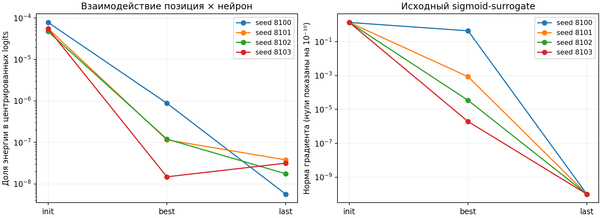
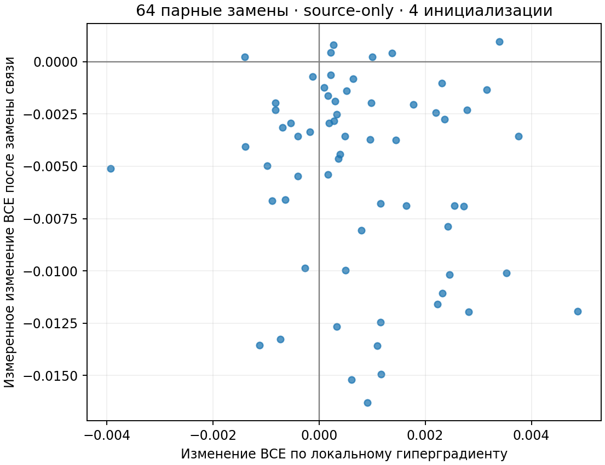
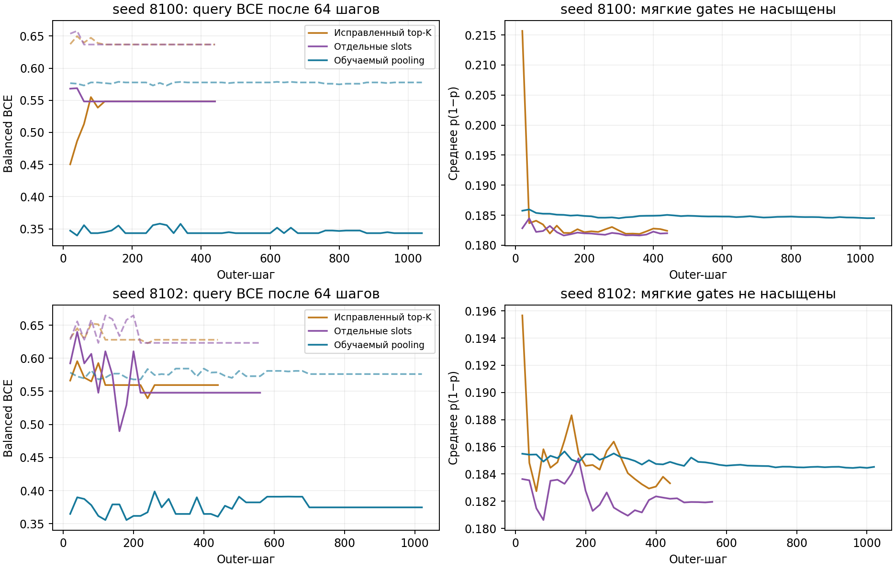
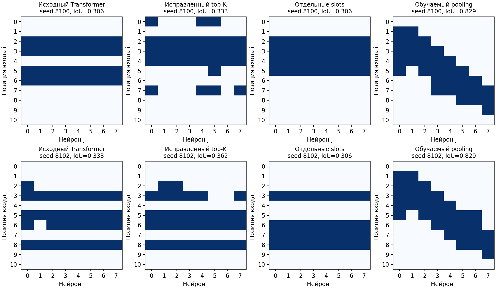
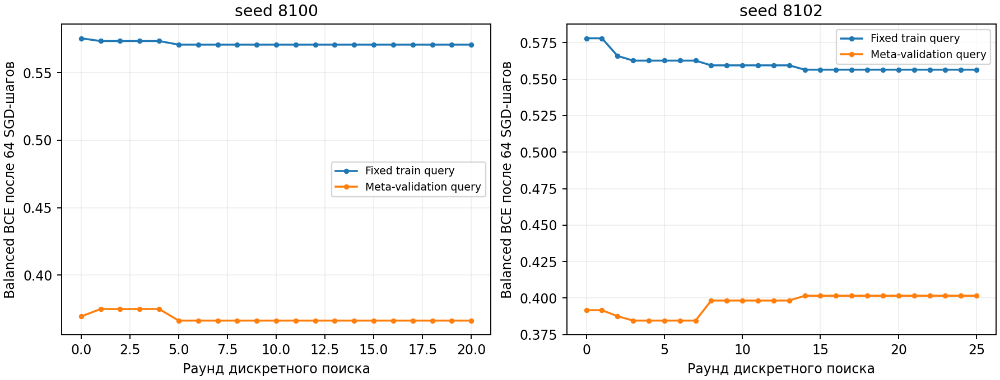
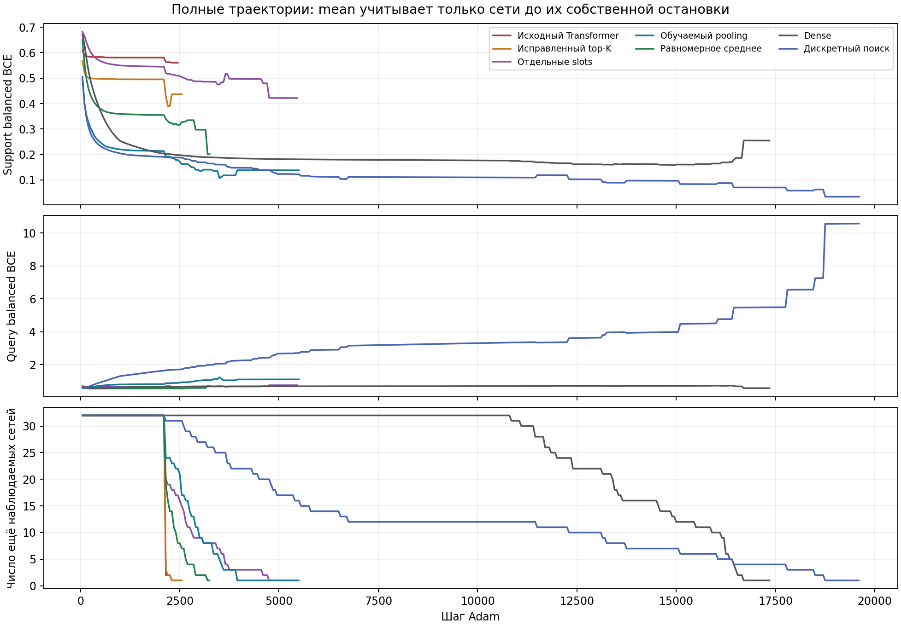

# Pattern: диагностика Transformer и повторная проверка моделей

Дата: 1 октября 2026 года. Банк состоит из **полных функциональных карт и state сетей**. Новые обучаемые модели не восстанавливают карты через reconstruction: их objective — query-качество свежей сети после обучения с предложенной маской. Матрица $U$ не используется.

**Исправление градиента top-K оказалось необходимо, но недостаточно.** И прежний decoder с исправленным surrogate, и новый Set Transformer со slots снова дали полосы. Более подходящее ограничение пространства предложений — positive pooling выровненных функциональных карт банка — даёт test BCE **0.5578** против **0.5997** у заново настроенного dense; точечно лучше на 4/4 задачах. Однако **равномерное functional mean ещё лучше: 0.5435**. Следовательно, отдельное преимущество обучения pooling над простым средним не показано. Дискретный поиск также улучшает dense, но не обходит среднее.

Это новый full-batch L2-протокол с двумя seeds и четырьмя свежими инициализациями на задачу. Его числа нельзя напрямую смешивать с прежней четырёхseedовой таблицей minibatch-Adam. На meta-validation dense выиграл от дополнительного L2-подбора; улучшение его качества на test относительно прежнего протокола отдельно не установлено.

## Где локализована проблема

**Наблюдалось:** у best checkpoints исходного decoder доля взаимодействия строки и столбца после удаления их главных эффектов — порядка $10^{-7}$–$10^{-6}$. Сами scores почти аддитивны, поэтому top-K предпочитает целые строки. В last checkpoints всех четырёх исходных seeds sigmoid-surrogate имеет практически нулевой backward. Прибавление одной константы ко всем scores сохраняет маску, но может обнулить выбранный исходный градиент — воспроизводимый дефект surrogate.

**Наблюдалось:** при source-only контроле на seed 8100 правильные окна дают query BCE 0,5756 на train-monitor и 0,3694 на meta-validation после тех же 64 SGD-шагов; полосы — 0,6514 и 0,5656. Следовательно, хорошие ограничения различимы в исходном finite-horizon objective. Простое увеличение горизонта без изменения обучения не решает всё: при 1024 SGD-шагах query-ошибка растёт, особенно у dense.

**Наблюдалось:** для 64 реальных парных замен связей в полосатой маске локальный гиперградиент совпал со знаком измеренного изменения query BCE в 32,8% случаев; корреляция −0,137. Реально улучшали objective 58/64 замен, локально предсказывались улучшения лишь для 17/64. Совпадение baseline при повторном батчевом расчёте — точное в данном запуске. Это показывает плохое соответствие continuous-градиента конечным дискретным изменениям именно в этой проверке.

**Вывод с ограничением:** увеличить decoder или убрать насыщение недостаточно для текущей схемы обучения. Проектировать следующий метод нужно с учётом реального эффекта дискретного изменения связей и сохранения bank-derived структуры. Проверка swaps относится к одному seed, одной маске и конечному solver; универсальная непригодность STE не доказана. Общая маска для разных pattern-задач сама по себе допустима: полезная оконная структура тоже общая.

Объяснения осей, шкал и границ вывода — в [подписях графиков](figures/captions.md). Численные проверки: [исходная диагностика](diagnosis/summary.json), [дискретные замены](diagnosis/discrete_swaps/summary.json).

## Что перезапущено

1. **Исправленный прежний Transformer:** forward — тот же binary global top-32; backward — нормированная fixed-mass sigmoid-relaxation с implicit threshold derivative. Масса мягких gates — 32; общий сдвиг logits не меняет их градиент. STE остаётся приближением дискретной задачи. CPU gradcheck и проверка shift-invariance прошли.
2. **Column-preserving Set Transformer:** отдельные teacher-column tokens, восемь attention-slots и явные взаимодействия position × slot в decoder. Нет оконного шаблона или weight sharing. Архитектурная основа — [Set Transformer](https://proceedings.mlr.press/v97/lee19d.html); это наша адаптация. Полосы вернулись после обучения на двух seeds.
3. **Обучаемый функциональный pooling:** модель читает полные 187-признаковые tokens, включая 128 значений $\psi_j(x)$, sensitivities, state и качество source-решения. Она выдаёт положительные веса source-картам и агрегирует их выровненные $\mathbb E|q_{ij}(x)|$. Итоговая маска — top-32 этого агрегата. Координатное centroid-выравнивание задано явно; обучаемой модели не приписываем его открытие. Инициализация — прежнее равномерное среднее.
4. **Дискретный поиск ограничений:** старт из того же функционального среднего; population из 24 exact-32 масок, парные изменения 1–4 связей или Gumbel top-K вокруг source-оценок. Реальное улучшение source-query после нового обучения сети определяет принятие маски. Гиперградиент через маску не используется. Метод формирует общий переносимый prior, не условную маску по новой задаче.

Неограниченный attention-pooling иногда концентрировал вес на одном teacher и терял градиент. Финальный pooling центрирует и нормирует scores и ограничивает их диапазон: в best checkpoints effective число source-карт по entropy — около 474 и 670 из 960. Ограничение поддерживает использование множества решений. Старый unbounded-вариант сохранён отдельно: один fit дошёл до cap, это не объявляется сходимостью.

Первый дискретный поиск со свежими случайными initialization seeds в каждом раунде часто принимал изменения, не дававшие стабильного улучшения fixed-monitor, и оба запуска дошли до cap. Для финального `bank_evolution_fixed` source objective зафиксирован на четырёх парных initialization seeds и одинаковых эпизодах; оба запуска вышли на plateau. Это снижает шум сравнения, но допускает overfit этих фиксированных инициализаций. Последующая оценка использует новые seeds.

## Результаты на прежних отложенных задачах

Support=128; 32 связи у всех sparse-методов, 88 у dense. Каждому методу независимо подобраны LR и L2 по одинаковой сетке на meta-validation; test-метрики не используются при подборе. Четыре прежних test-задачи принадлежат одной reversal/complement-орбите. По 32 свежих сети на метод: 2 source-банка × 4 задачи × 4 инициализации. IoU — post-hoc Hungarian относительно правильной поддержки, без участия в обучении или выборе моделей.

| Метод | Test balanced BCE ↓ | Test balanced accuracy ↑ | Задач лучше dense | Mean IoU |
|---|---:|---:|---:|---:|
| Исходный Transformer | 0.6333 | 0.6456 | 0/4 | 0.320 |
| Исправленный top-K | 0.6419 | 0.6589 | 0/4 | 0.348 |
| Отдельные slots | 0.6350 | 0.6476 | 0/4 | 0.306 |
| Обучаемый pooling | 0.5578 | 0.7257 | 4/4 | 0.829 |
| Равномерное среднее | 0.5435 | 0.7274 | 4/4 | 1.000 |
| Dense | 0.5997 | 0.6808 | 0/4 | 0.364 |
| Дискретный поиск | 0.5736 | 0.7158 | 4/4 | 0.803 |

| Pattern | Dense | Обучаемый pooling | Равномерное среднее | Дискретный поиск |
|---|---:|---:|---:|---:|
| 0010 | 0.6022 | 0.5301 | 0.5381 | 0.5518 |
| 0100 | 0.6016 | 0.5689 | 0.5647 | 0.5695 |
| 1011 | 0.5935 | 0.5641 | 0.5144 | 0.5904 |
| 1101 | 0.6016 | 0.5680 | 0.5567 | 0.5826 |

В этой проверке **обучаемое взвешивание улучшило равномерное среднее только на одной из четырёх задач** (`0010`); в среднем оно хуже на 0,0143 BCE. Ни один новый обучаемый вариант не восстановил точную поддержку всех окон на выбранных best checkpoints. Равномерный baseline сохранил точные окна в двух использованных банках. Близкая к правильной поддержка не означает, что actual signed weights стали точной теплицевой матрицей.

## Сходимость и воспроизводимость

**Все 1232 validation/test-траектории дочерних сетей прошли установленный empirical plateau**, включая все 224 финальные сети. Проверяются support BCE, regularized objective и query BCE: три последовательных проверки двух окон по 8 оценок, изменение среднего и тренд ≤0,1%, minimum 2000 steps. После первичного cap 16 000 активные validation-запуски продолжены с дополнительным понижением LR; ранние состояния и cap-статусы сохранены в `initial_regularized_tune_16000`. Это эмпирическая стабилизация кривых при данном LR schedule, **не доказательство нулевого градиента, глобального оптимума или оптимальности маски**.

Качество test относится к лучшему query-checkpoint; такой checkpoint может предшествовать plateau. Полные последние состояния и индивидуальные кривые сохранены отдельно. Для финального сравнения выполнено 1008 validation-кандидатов и 224 test-фита; каждый test оценивается на всех 414 входах. Восемь основных outer-процедур (две пары Transformer, bounded pooling и fixed discrete search) прошли свои source train/validation plateau-критерии. Negative диагностические запуски с cap показаны отдельно выше.

Независимая NumPy-проверка всех трёх plateau-прохождений для всех 1232 trajectories и пересчёт 224 test-метрик из реальных $W,M,b,a,c$ прошли. Максимальная разница метрик — $1{,}19\times10^{-7}$. Проверены hashes source-банков и model checkpoints, frozen LR/L2 и final-child states, разделение support/query/test IDs и exact число связей. Сравнение vectorized Adam с обычным независимым Adam дало максимальную разницу параметров $1{,}19\times10^{-7}$ на CPU-тесте.

[Независимая проверка](independent_audit.json) · [Зафиксированные параметры](regularized_selection.json) · [Точный протокол](PROTOCOL_RU.md) · [Все результаты](records.json) · [Численные массивы](summary_arrays.npz) · [Пояснения графиков](figures/captions.md).

## Ограничения и следующий осмысленный шаг

- Только два seeds и четыре test-задачи одной орбиты; test-split уже анализировался раньше. Это exploratory повтор, не новый независимый тест универсального переноса.
- Source-bank содержит решения без подтверждённого plateau. В этом опыте банк зафиксирован, его переобучение не проводилось.
- Coordinate alignment у functional mean, pooling и discrete search — явный prior. Отдельный вклад функционального сигнала сверх этого правила ещё требует null-контроля с тем же выравниванием.
- Outer objective — 64 SGD-шагов без L2, финальное обучение — full-batch Adam с L2. Solver mismatch сохранился; validation-выбор пары задач `0000`, `1111` может плохо представлять другие задачи. Ненасыщенный surrogate не устраняет mismatch дискретного forward и continuous backward.
- Простое mean остаётся лучшим по средней BCE. **Приоритет следующего метода — реальная query-оценка изменений bank-derived ограничений с более согласованным inner solver и разнообразными validation-задачами**, а не увеличение генератора ради генеративности. Новое обучение должно показать выигрыш сверх этого сильного functional baseline, а не только над dense.

Все новые результаты и source snapshots сохранены отдельно от исходного опыта. GPU-запуски завершены.
