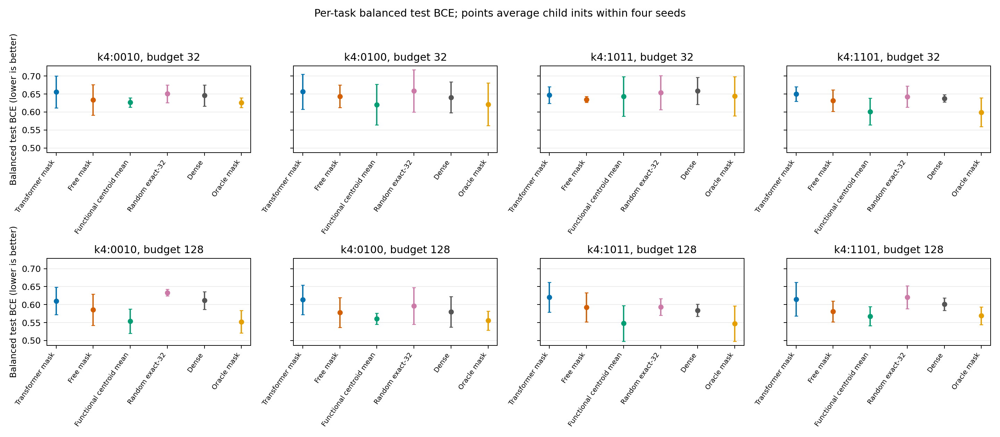
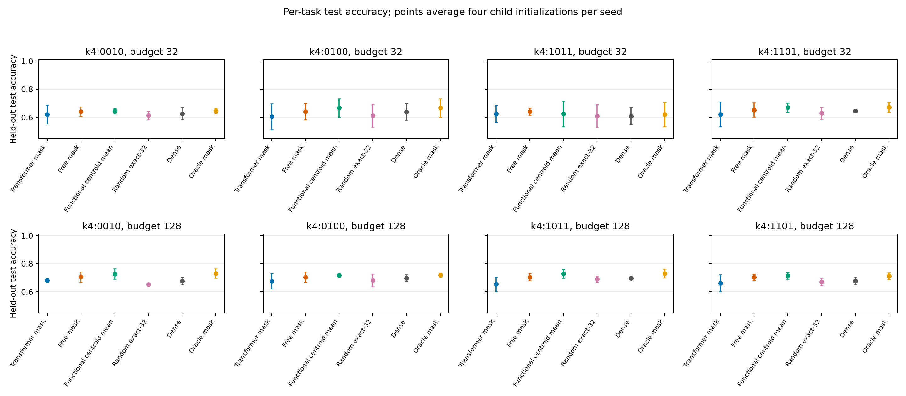
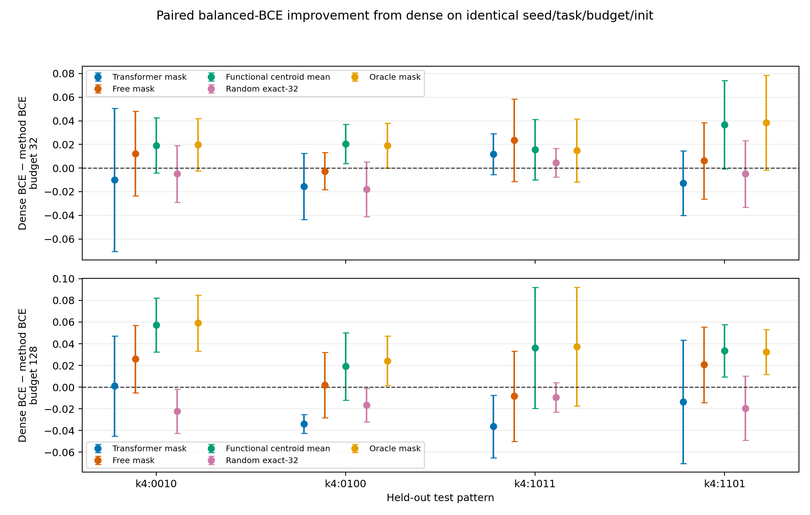
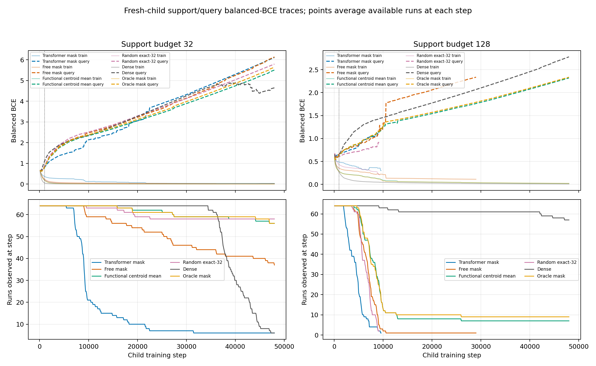
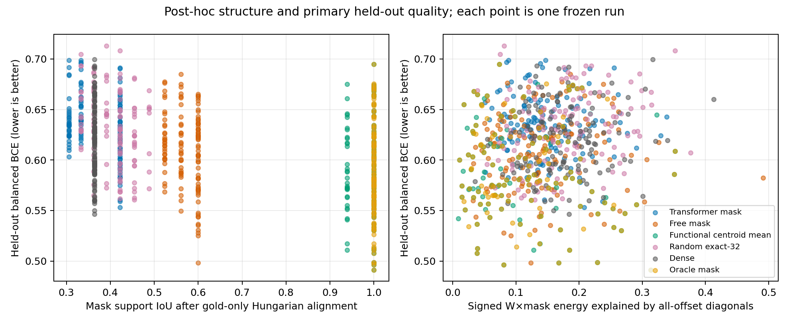
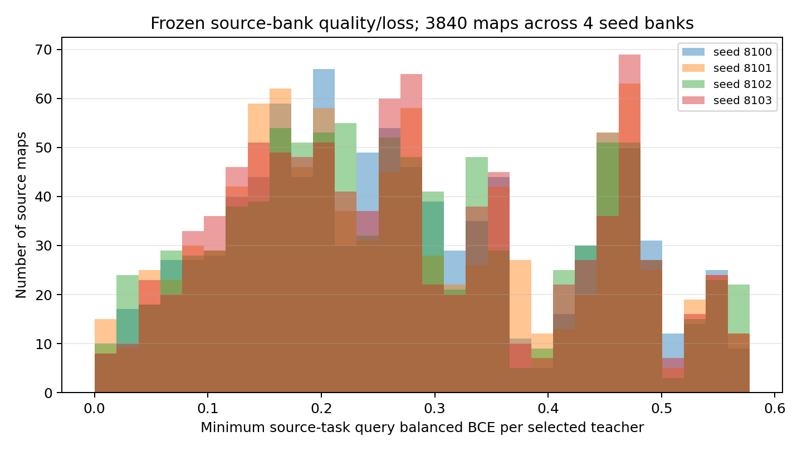
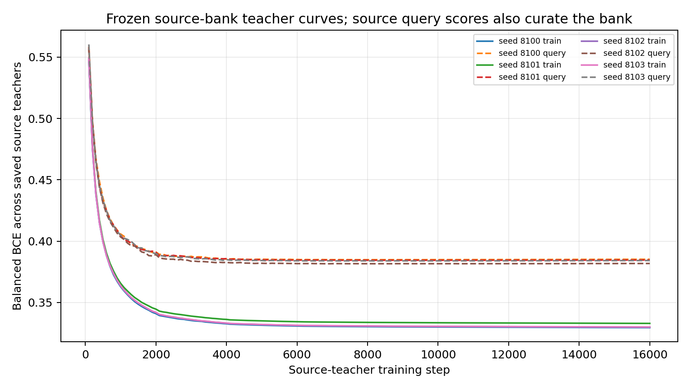
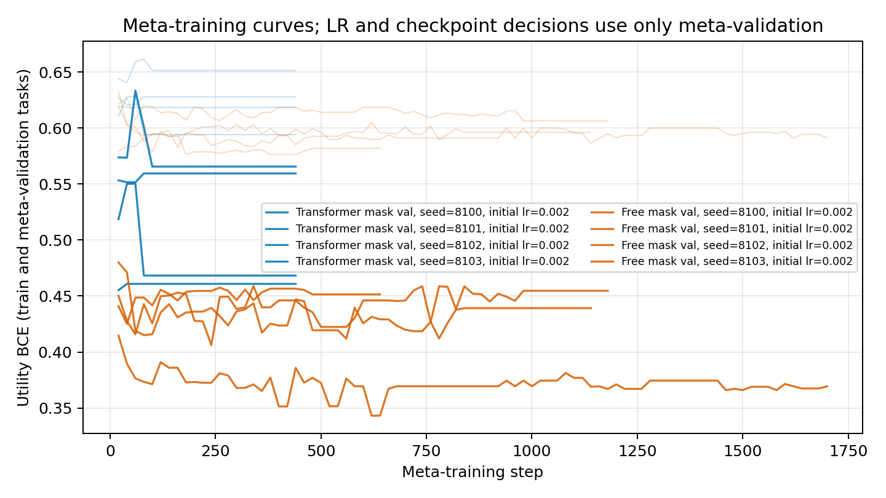

# Task-quality and Toeplitz-structure evaluation

This report compares six fixed-mask methods on four held-out length-4 patterns. The four test patterns are members of a single reversal/complement orbit, so they are related tasks rather than four independent task orbits. Utility tasks use binary length-11 inputs and width-8 ReLU children. Every sparse method has exactly 32 active edges; dense has 88; the oracle mask is a gold-only reference. Each condition uses outer seeds 8100–8103 and four paired fresh-child initializations.

The primary score is class-balanced held-out BCE; lower is better. Natural accuracy, balanced accuracy, natural BCE and Brier score are secondary metrics. Checkpoints are selected by query balanced BCE and frozen before test scoring. Each test uses the complete 414-ID test partition from the finite 2,048 input space; query selection uses the complete 408-ID query partition. Balanced 32/128 support IDs, query IDs and test IDs are disjoint. Test labels are used only for the final report.

## Primary per-task balanced BCE

Each point averages the four child initializations within a seed, then averages the four outer-seed means. Brackets show descriptive 95% Student-t intervals across those four seed means (df=3). Balanced BCE gives equal weight to positive-class and negative-class BCE.

| Budget | Test pattern | Transformer mask | Free mask | Functional centroid mean | Random exact-32 | Dense | Oracle mask |
|---:|---|---:|---:|---:|---:|---:|---:|
| 32 | `k4:0010` | 0.656 [0.611, 0.700] | 0.634 [0.591, 0.676] | 0.627 [0.614, 0.639] | 0.651 [0.626, 0.676] | 0.646 [0.616, 0.675] | 0.626 [0.613, 0.639] |
| 32 | `k4:0100` | 0.656 [0.607, 0.705] | 0.643 [0.612, 0.675] | 0.620 [0.564, 0.677] | 0.659 [0.600, 0.718] | 0.641 [0.598, 0.684] | 0.622 [0.562, 0.681] |
| 32 | `k4:1011` | 0.647 [0.624, 0.670] | 0.635 [0.626, 0.644] | 0.643 [0.588, 0.698] | 0.654 [0.607, 0.702] | 0.659 [0.621, 0.696] | 0.644 [0.590, 0.698] |
| 32 | `k4:1101` | 0.650 [0.630, 0.671] | 0.632 [0.602, 0.661] | 0.601 [0.564, 0.638] | 0.643 [0.613, 0.672] | 0.638 [0.628, 0.648] | 0.599 [0.559, 0.639] |
| 128 | `k4:0010` | 0.610 [0.572, 0.649] | 0.585 [0.542, 0.629] | 0.554 [0.520, 0.588] | 0.633 [0.624, 0.643] | 0.611 [0.587, 0.636] | 0.552 [0.521, 0.583] |
| 128 | `k4:0100` | 0.613 [0.572, 0.654] | 0.578 [0.536, 0.619] | 0.561 [0.545, 0.576] | 0.596 [0.545, 0.648] | 0.580 [0.537, 0.622] | 0.555 [0.529, 0.582] |
| 128 | `k4:1011` | 0.620 [0.579, 0.662] | 0.593 [0.552, 0.633] | 0.548 [0.498, 0.598] | 0.594 [0.570, 0.617] | 0.584 [0.567, 0.601] | 0.547 [0.498, 0.596] |
| 128 | `k4:1101` | 0.615 [0.568, 0.662] | 0.581 [0.552, 0.610] | 0.568 [0.541, 0.594] | 0.621 [0.589, 0.653] | 0.601 [0.584, 0.619] | 0.569 [0.544, 0.593] |

## Secondary accuracy

Natural accuracy uses a strict logit threshold greater than zero, matching the child model. Balanced accuracy weights positive and negative recall equally. These values are secondary to balanced BCE.

## Paired balanced-BCE improvement over dense

Each difference pairs identical outer seed, held-out task, budget and fresh-child initialization. Positive improvement means the method's balanced BCE is lower than dense's. `Fraction tasks improved` counts held-out patterns with positive mean paired improvement; `Worst task improvement` is the minimum of the four task means. These four related patterns do not support a guarantee for unseen tasks.

| Budget | Method | Mean improvement (dense BCE − method BCE) | 95% t interval across seeds | Fraction tasks improved | Worst task improvement |
|---:|---|---:|---:|---:|---:|
| 32 | Transformer mask | -0.007 | [-0.011, -0.002] | 0.25 | -0.016 |
| 32 | Free mask | +0.010 | [-0.003, +0.023] | 0.75 | -0.003 |
| 32 | Functional centroid mean | +0.023 | [+0.007, +0.039] | 1.00 | +0.016 |
| 32 | Random exact-32 | -0.006 | [-0.024, +0.012] | 0.25 | -0.018 |
| 32 | Dense | +0.000 | [+0.000, +0.000] | 0.00 | +0.000 |
| 32 | Oracle mask | +0.023 | [+0.007, +0.039] | 1.00 | +0.015 |
| 128 | Transformer mask | -0.021 | [-0.046, +0.005] | 0.25 | -0.036 |
| 128 | Free mask | +0.010 | [-0.017, +0.037] | 0.75 | -0.008 |
| 128 | Functional centroid mean | +0.037 | [+0.018, +0.055] | 1.00 | +0.019 |
| 128 | Random exact-32 | -0.017 | [-0.027, -0.007] | 0.00 | -0.022 |
| 128 | Dense | +0.000 | [+0.000, +0.000] | 0.00 | +0.000 |
| 128 | Oracle mask | +0.038 | [+0.021, +0.056] | 1.00 | +0.024 |

Natural-accuracy paired differences are retained as a secondary outcome in [`figures/paired_accuracy_deltas.png`](figures/paired_accuracy_deltas.png) and `summary.json`.

## Frozen learning-rate selection

Each method and support budget uses one learning rate from $\{0.001,0.003,0.01\}$ selected by mean query balanced BCE on the two meta-validation patterns, across seeds 8100–8103 and child initializations 0–3. The selected rate is frozen across all four test patterns. No test score contributes to this choice.

| Budget | Method | Selected LR | Query balanced BCE at 0.001 | at 0.003 | at 0.01 |
|---:|---|---:|---:|---:|---:|
| 32 | Transformer mask | 0.001 | 0.5720 | 0.5758 | 0.6353 |
| 128 | Transformer mask | 0.003 | 0.4728 | 0.4722 | 0.4761 |
| 32 | Free mask | 0.001 | 0.5245 | 0.5355 | 0.5970 |
| 128 | Free mask | 0.003 | 0.3615 | 0.3600 | 0.3632 |
| 32 | Functional centroid mean | 0.001 | 0.5116 | 0.5222 | 0.5883 |
| 128 | Functional centroid mean | 0.003 | 0.3252 | 0.3172 | 0.3217 |
| 32 | Random exact-32 | 0.001 | 0.5525 | 0.5585 | 0.6227 |
| 128 | Random exact-32 | 0.001 | 0.3833 | 0.3840 | 0.3888 |
| 32 | Dense | 0.001 | 0.5034 | 0.5093 | 0.6418 |
| 128 | Dense | 0.001 | 0.3712 | 0.3730 | 0.3890 |
| 32 | Oracle mask | 0.001 | 0.5095 | 0.5194 | 0.5839 |
| 128 | Oracle mask | 0.003 | 0.3243 | 0.3196 | 0.3243 |

## Child convergence and checkpoint completion

Train and query traces are retained at their recorded steps. Runs that reach the configured step cap without meeting the convergence rule remain labeled unconverged; the cap is never treated as successful convergence. Query checkpoint selection completion is reported separately.

| Budget | Method | Runs | Converged | Unconverged | At step cap | Query checkpoint selected | Mean steps |
|---:|---|---:|---:|---:|---:|---:|---:|
| 32 | Transformer mask | 64 | 58 | 6 | 6 | 64 | 14034 |
| 128 | Transformer mask | 64 | 64 | 0 | 0 | 64 | 4445 |
| 32 | Free mask | 64 | 27 | 37 | 37 | 64 | 38408 |
| 128 | Free mask | 64 | 64 | 0 | 0 | 64 | 7175 |
| 32 | Functional centroid mean | 64 | 8 | 56 | 56 | 64 | 45809 |
| 128 | Functional centroid mean | 64 | 57 | 7 | 7 | 64 | 12538 |
| 32 | Random exact-32 | 64 | 6 | 58 | 58 | 64 | 45117 |
| 128 | Random exact-32 | 64 | 64 | 0 | 0 | 64 | 6509 |
| 32 | Dense | 64 | 58 | 6 | 6 | 64 | 40588 |
| 128 | Dense | 64 | 7 | 57 | 57 | 64 | 46016 |
| 32 | Oracle mask | 64 | 8 | 56 | 56 | 64 | 45844 |
| 128 | Oracle mask | 64 | 55 | 9 | 9 | 64 | 13630 |

## Mask and signed-weight structure

Hidden columns are matched to canonical four-edge windows by a Hungarian assignment that uses only binary mask overlap. This assignment is post-hoc and uses the gold support only for reporting. Mask IoU measures support recovery. The weight audit separately measures how much squared norm of the signed trained `W×mask` lies in the constant-offset diagonal subspace across all offsets, and in the oracle band $i-h\in\{0,1,2,3\}$. These are distinct quantities: support recovery does not imply repeated signed weights.

ReLU units have a positive rescaling gauge: scaling a hidden unit's incoming weights and bias by a positive factor while inversely scaling its readout leaves the function unchanged. The raw signed `W×mask` projection is therefore coordinate- and gauge-dependent. We also report `a_j W_j M_j`, invariant to positive hidden rescaling, and incoming affine columns `[W_j M_j,b_j]` normalized by their joint L2 norm. The heatmap retains raw trained `W×mask`; readout signs are preserved. Binary support recovery is independent of this weight gauge. A low raw-weight projection alone cannot establish absence of functionally Toeplitz behavior.

Full per-run masks, aligned weights, projection values, offset histograms and Hungarian permutations are in `structure.jsonl` and `structure_metrics.npz`. `selected_example.npz` stores the fixed-condition matrices behind the heatmap.

## Figures and numeric artifacts

Figure axes, color scales, conditions and interpretation limits are recorded in [`figures/captions.md`](figures/captions.md). `records.jsonl` stores run-level IDs, masks, weights, provenance and status; `summary.npz` stores aligned numeric test metrics and selected rates; paired dense deltas are in `paired_deltas.npz`; structure metrics are in `structure_metrics.npz`.

Source-bank quality figure rendered: **True**. Source-teacher loss curves rendered: **True**. Meta-training curves rendered: **True**. Child convergence curves rendered: **True**.

## Source and training diagnostics

## Limitations

Intervals are descriptive with four outer seeds and use $t_{0.975,3}$. The four held-out patterns are members of one reversal/complement orbit and are related rather than independent tasks. The task-averaged score and fraction improved do not guarantee improvement on every future pattern. One frozen source bank is used per independent fit; bank content is not varied, so this pilot does not measure bank generalization or establish causal bank use. `free_mask` differs from the Transformer in context and architecture as well as bank input, so it is not a pure bank ablation. Meta-training differentiates through a 64-step SGD inner loop, but the binary top-$K$ mask uses a hard-forward sigmoid straight-through estimator; its backward signal is a biased surrogate, not the exact gradient of the discrete-mask objective. Final children use Adam with a validation-tuned rate and query-selected checkpoint, so their optimizer and horizon differ from the finite meta-training utility objective. Structure is audited after training and does not affect checkpoint selection. The analytic oracle mask is a structural reference and must not be treated as a learned result.
