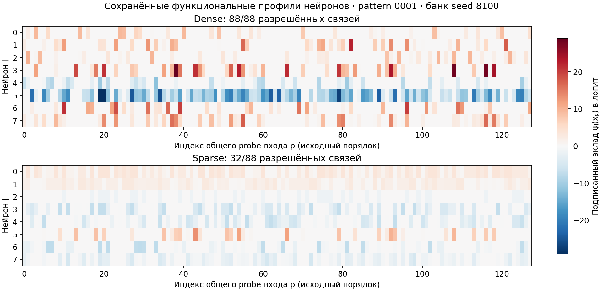
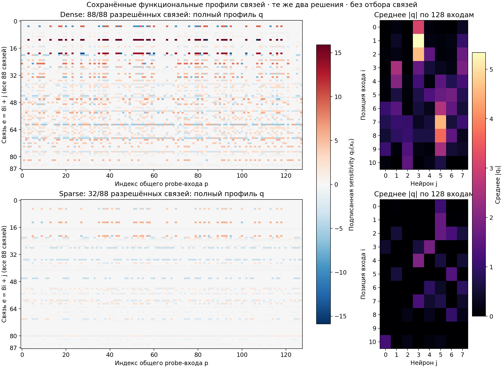

# Примеры сохранённых функциональных карт pattern

Показаны две реальные сети из банка seed 8100 для source-задачи `0001`: первое сохранённое dense-решение (индекс 64, 88 разрешённых связей из 88) и первое сохранённое решение с 32 связями (индекс 0). Примеры выбраны по порядку банка, без отбора по виду графика. В обоих случаях 11 входных координат, 8 ReLU-нейронов и одна общая выборка из 128 probe-входов. Порядок входов и нейронов сохранён; выравнивание и усреднение разных решений не применялись.

## Что сохраняется и где задаётся разреженность

**При сохранении функциональных карт дополнительную sparsity не задаём:** сохраняются все 128 × 8 вкладов нейронов и все 128 × 11 × 8 значений sensitivity связей, включая нули. В полном банке дополнительно сохраняются исходные веса, эффективные веса, маски, biases, readout, качество, происхождение и идентификаторы probe-входов.

**Исходные сети уже обучались с масками:** в этом pattern-банке представлены 32, 44 и 88 разрешённых связей из 88. Поэтому карты наследуют ограничения исходной сети: при $M_{ij}=0$ эффективный вес и функциональная sensitivity этой связи равны нулю. Это не доказывает бесполезность запрещённой связи — её влияние в этой сети не наблюдалось. Нулевое значение также возможно для разрешённой связи, например при неактивном ReLU.

Отдельно, уже после извлечения или обучения ограничения, текущий протокол выбирает итоговую маску с 32 связями. Это не обрезает исходные сохранённые карты. «Полностью сохраняются» означает полный state сети и полные профили на выбранных 128 входах; профиль не перечисляет функцию на всех возможных входах. Полный state позволяет пересчитать её на других входах.

## График 1: вклады нейронов

По X — индекс probe-входа, по Y — hidden-нейрон. Сверху dense, снизу sparse. Цвет показывает подписанный вклад нейрона в выходной логит:

$$
\psi_j(x_p)=a_j\operatorname{ReLU}\!\left(x_p^\top W_{\mathrm{eff},:j}+b_j\right).
$$

Красное означает положительный вклад, синее — отрицательный, белое — нуль. Шкала общая для обеих сетей, без нормировки каждого нейрона. Видна зависимость вкладов от входа и разница их амплитуд. Одноимённые строки двух сетей не обязательно соответствуют одному признаку: hidden-нейроны не выравнивались. Отдельные вклады могут компенсировать друг друга; их величина сама по себе не измеряет качество сети.

## График 2: чувствительности связей

Слева по X — тот же probe-вход, по Y — все 88 связей в порядке $e=8i+j$. Цвет показывает подписанную sensitivity выходного логита к мультипликативному изменению эффективного веса:

$$
q_{ij}(x_p)=W_{\mathrm{eff},ij}\,x_{p,i}\,a_j\,mathbf{1}\!\left(x_p^\top W_{\mathrm{eff},:j}+b_j>0\right).
$$

Сохранены все значения, без top-K или порога. Общая симметричная шкала позволяет сравнить две сети. У sparse-сети многие строки нулевые из-за исходной маски; нулевые значения у разрешённых связей также возможны.

Справа — производная статистика $S_{ij}=\frac{1}{128}\sum_p|q_{ij}(x_p)|$, а не полный функциональный профиль. По X — нейрон, по Y — входная координата; светлое означает большую среднюю sensitivity, чёрное — нуль. Шкала общая для двух сетей. Именно такой тип статистики использовал baseline с координатным выравниванием, но изображённые здесь карты принадлежат отдельным решениям, а не среднему банка.

## Данные и проверка

[Численные массивы и состояния двух сетей](examples.npz) · [Происхождение, индексы и hash банка](provenance.json) · [Воспроизводимый построитель графиков](plot_examples.py).

Проверено соответствие $W_{\mathrm{eff}}=W\odot M$, средних $|q|$ полным профилям и нулевых sensitivity запрещённых связей. Исходный банк не изменён; новых запусков обучения не было.
