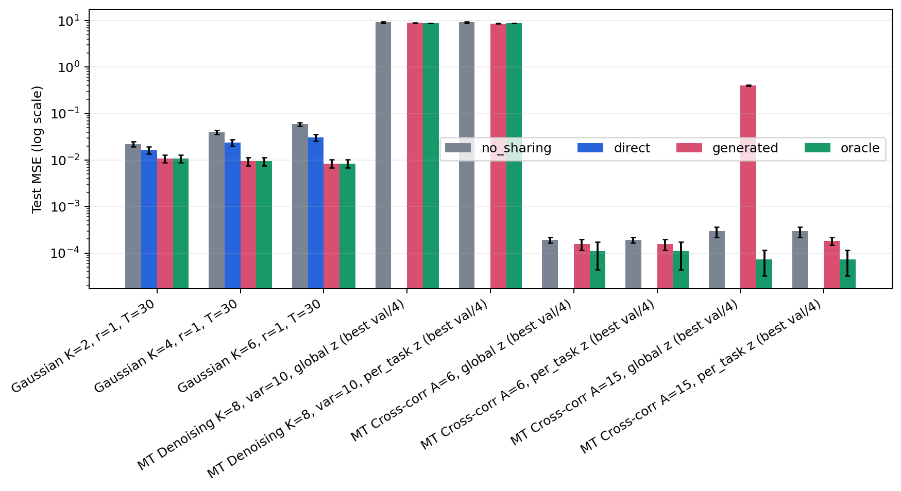

# Yeh et al. (2022): direct versus generated parameter sharing

Общая таблица сопоставляет опубликованные числа, нашу реализацию прямой оптимизации assignment-матрицы и параметризацию `A = Gψ(z)`.

## Test loss

| Benchmark | Paper direct A | Our direct A | Generated A | No sharing | Oracle |
|---|---:|---:|---:|---:|---:|
| Gaussian K=2, r=1, T=30 | 0.014 ± 0.003 | 0.016421 ± 0.0027 | 0.010841 ± 0.0019 | 0.022298 ± 0.0028 | 0.010841 ± 0.0019 |
| Gaussian K=4, r=1, T=30 | 0.025 ± 0.003 | 0.023992 ± 0.004 | 0.0094668 ± 0.002 | 0.039626 ± 0.004 | 0.0094668 ± 0.002 |
| Gaussian K=6, r=1, T=30 | 0.028 ± 0.004 | 0.030741 ± 0.005 | 0.0084429 ± 0.0017 | 0.058994 ± 0.0049 | 0.0084429 ± 0.0017 |
| MT Denoising K=8, var=10, global z (best val/4) | — (Figure A1 only) | — | 8.9169 ± 0.044 | 9.1391 ± 0.26 | 8.8388 ± 0.062 |
| MT Denoising K=8, var=10, per_task z (best val/4) | — (Figure A1 only) | — | 8.6676 ± 0.094 | 9.1391 ± 0.26 | 8.8388 ± 0.062 |
| MT Cross-corr A=6, global z (best val/4) | — (Sec. 5.3) | — | 0.00015609 ± 3.9e-05 | 0.00019193 ± 2.8e-05 | 0.00010896 ± 6.5e-05 |
| MT Cross-corr A=6, per_task z (best val/4) | — (Sec. 5.3) | — | 0.00015609 ± 3.9e-05 | 0.00019193 ± 2.8e-05 | 0.00010896 ± 6.5e-05 |
| MT Cross-corr A=15, global z (best val/4) | — (Sec. 5.3) | — | 0.40269 ± 0.0059 | 0.00029336 ± 7.4e-05 | 7.3399e-05 ± 4.1e-05 |
| MT Cross-corr A=15, per_task z (best val/4) | — (Sec. 5.3) | — | 0.00018476 ± 3.5e-05 | 0.00029336 ± 7.4e-05 | 7.3399e-05 ± 4.1e-05 |

## Partition distance

| Benchmark | Paper direct A | Our direct A | Generated A | No sharing | Oracle |
|---|---:|---:|---:|---:|---:|
| Gaussian K=2, r=1, T=30 | 0.145 ± 0.05 | 0.185 ± 0.054 | 0 ± 0 | 1 ± 0 | 0 ± 0 |
| Gaussian K=4, r=1, T=30 | 0.49 ± 0.095 | 0.435 ± 0.092 | 0 ± 0 | 3 ± 0 | 0 ± 0 |
| Gaussian K=6, r=1, T=30 | 0.59 ± 0.13 | 0.675 ± 0.14 | 0 ± 0 | 5 ± 0 | 0 ± 0 |
| MT Denoising K=8, var=10, global z (best val/4) | — (Figure A1 only) | — | 32 ± 0 | 49 ± 0 | 0 ± 0 |
| MT Denoising K=8, var=10, per_task z (best val/4) | — (Figure A1 only) | — | 31.6 ± 1.2 | 49 ± 0 | 0 ± 0 |
| MT Cross-corr A=6, global z (best val/4) | 0 ± 0 | — | 1 ± 0 | 3 ± 0 | 0 ± 0 |
| MT Cross-corr A=6, per_task z (best val/4) | 0 ± 0 | — | 1 ± 0 | 3 ± 0 | 0 ± 0 |
| MT Cross-corr A=15, global z (best val/4) | 0 ± 0 | — | 6 ± 0 | 11 ± 0 | 0 ± 0 |
| MT Cross-corr A=15, per_task z (best val/4) | 0 ± 0 | — | 7 ± 0 | 11 ± 0 | 0 ± 0 |

## Границы сравнения

- Числа paper указаны только там, где они напечатаны в таблице или явно сформулированы в тексте; значения с графиков не выдаются за точные.
- Официальный release не содержит `projects/ConvSharing`, поэтому наши cross-correlation и denoising являются документированной реализацией постановки, а не побитовой репликацией кода авторов.
- Gaussian: paper пишет Adam, опубликованный код запускает RMSprop; конкретный optimizer сохраняется в каждой строке результата.
- † В текущем Gaussian-протоколе один `Gψ` совместно обучается на всех оцениваемых Monte Carlo задачах. Это transductive multi-task результат, а не проверка переноса на новые задачи.
- Multi-task linear: один `Gψ` обучается на пяти задачах; показаны варианты с общим и task-specific `z`. Используется exact constrained lower loss и бинарный forward со straight-through gradient.
- Настройки выбраны только по validation на минимальном benchmark: cross-correlation `lr=3e-4, ridge=1e-2`; denoising `lr=1e-2, ridge=1e-1`. Для результата выбирается лучший по validation из четырёх рестартов.
- Sum-of-numbers включает математически необходимый множитель `alpha` в Neumann-ряде; helper официального release его опускает.

Источники: [статья](https://proceedings.mlr.press/v151/yeh22b/yeh22b.pdf), [официальный код](https://github.com/raymondyeh07/equivariance_discovery).
